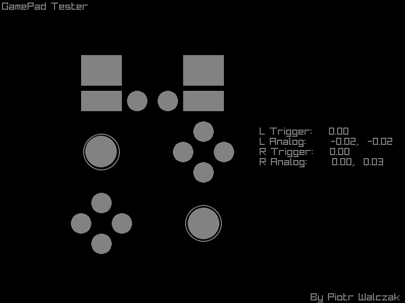

# Linux Gamepad Tester

  

This project was made to find and analise possible issues with a game controller (like XBox One) that is connected to your PC. It allows to determine if there are any problems visually and numerically.

## Dependencies

* [Raylib](https://github.com/raysan5/raylib) - simple library for easy GUI creation and input control

## How to build

* Generate solution files with included [premake](https://premake.github.io/) script.
* Compile project using generated solution files.
* Run compiled project. It should be in `bin/config/` folder.

## Common Issues

* If you run the program and it tells you that no gamepad is connected there is a possibility that your gamepad is not supported (at least in GLFW3) or i didn't add the support for that gamepad (less possible).

## Contributing

Feel free to propose any changes. I will accept pull requests after analysing them.
If you have any suggestions, bug reports, or feature requests, feel free to open an issue on GitHub.
